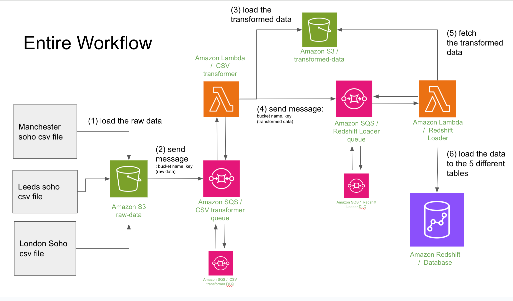
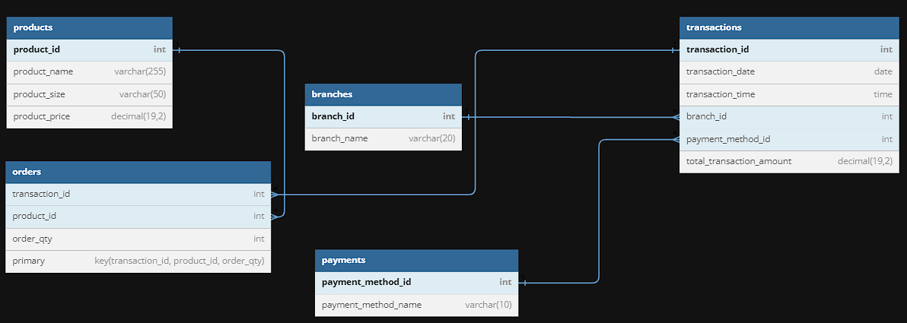

# moccha-madness-final-project

## About
This software is designed for a cafe business owner with multiple offline stores. The client’s existing software only generates daily sales data for individual stores and does not provide a consolidated view of the entire business’s performance. This makes it difficult to gain valuable insights, such as customer targeting and best-selling products. Our software solves this problem by delivering an ETL pipeline that extracts sales data from the client’s sources, transforms it, and loads it into the client’s data warehouse, providing a comprehensive overview of the business’s performance.
<br>
> **Current Client Setup:**
- CSV file for each branch
- File Generation Time: 8 p.m
- Daily, Weekly, Montlhy Reports (on sales, other business metrics)
- Time-consuming Collation of all CSV files

> **Vision:**
- The new software should load CSV file on Cloud every night.
- The new software should have ETL pipeline.
- The new software should have monitoring system.

## Elevator Pitch

- **For** cafe business owner with multiple branches
- **who** wants to see the whole picture of their business <br>
- (targeting customers, the best-selling products, etc) in all branches <br>
- **the** new software <br>
- **is** a customer facing software <br>
- **that** allows customers to collate all data from each stores and gain valuable business insight in a timely manner<br>
- **unlike** the current software which is limited to sales tracking of one store at a time and data collation is time-consuming.<br>
- **our product** will allow customers to utilise their sales data to drive business growth.


## Authors

Developers
- Sam Feighery   [Linkedin](https://www.linkedin.com/in/sam-feighery-b5265126/) | [Github](https://github.com/Sam-Feighery)<br>
- Kendrick Filho   [Linkedin](https://www.linkedin.com/in/misael-filho/) | [Github](https://github.com/mkmfilho/)<br>
- Ife Adeoti  [Github](https://github.com/S44WSA)<br>
- Dana Kim   [Linkedin](https://www.linkedin.com/in/haneul-kim-987b7744/) | [Github](https://github.com/ttcielott/)<br>
- Rishi Ravindran  [Linkedin](https://www.linkedin.com/in/rishiram-ravindran-a00127238/) | [Github](https://github.com/Rishi06R)<br>


## AWS Data Pipeline Workflow
</image>

## Data ETL Process Walk-through


https://github.com/generation-de-lon9/moccha-madness-final-project/assets/61944418/c1f6cf4f-ea63-4a99-b9a7-5fa1a852380f

## Database Schema
</image>

## Grafana Sales Dashboard

- After CSV files go through our ETL pipeline, the tranformed files are then stored in a Redshift DB
- We created a dashboard to enable the our client to view relevant information on the company's performance  


- You can find JSON File for recreating this dashboard
  ```
  Documentation/Mocha Madness - Sales Dashboard.json
  ```
## Grafana Monitoing Dashboard
By querying log metrics in AWS Cloudwatch, we created the monitoring dashboard.
### AWS Lambda Function
- We monitor the number of invocations, throttle, errors, and duration.
- When there are numbers in errors, we go investigate the cause of the error in Cloudwatch and fix the issue. 


### AWS SQS
- We keep track of any discrepancies in the number of messages sent, received, and deleted.
- We also monitor the number of messages in Dead Letter Queues that have been received by consumers more than 10 times but were not successfully processed and therefore not deleted.


You can find JSON File for recreating this dashboard
- 
  ```
  Documentation/Mocha Madness - Sales Dashboard.json
  ```

### Some basic Git commands are:
```
git status
git add
git commit

```


## Local Running
### 1. Initial Setup:
----------
#### Run Bash Script file:
After git clone this repository, you can run the following bash script file for initial setup (docker compose, creation of a virtual environment, package installation, and activation of a virtual environment).

```
chmod +x init.sh
./init.sh
```

#### OR Run Command Line Step by Step
**1) Commands to setup docker:**
```
cd database
docker compose up -d
```

**2) Creating venv:**
```
Windows - py -3.10 -m venv .venv
Mac - python3.10 -m venv .venv
```

**3) Activating venv:**
```
Windows - .venv/Scripts/Activate.bat
Mac - source .venv/bin/activate
``` 


**4) Installing packages from requirments:**
```
cd main_files
pip install -r requirements.txt
```

Note: if you see an error installing the package, `psycopg2==2.9.6`, please open `requirements.txt` file and replace it with `psycopg-binary` and re-run `pip install -r requirements.txt`.

### 2. Working with Database:
----------
* Command to run a file as module in python:
```
Windows - py -m <folder name>.<filename only without extension i.e .py>
Mac - python -m m<folder name>.<filename only without extension i.e .py>

```
### Table Creation
```
Windows - py -m main_files.table_creation.py
Mac - python -m main_files.table_creation.py
```

### Loading Data to Tables:
```
Windows
py -m main_files.table_insertion_product.py
py -m main_files.table_insertion_branch.py
py -m main_files.table_insertion_payment.py
py -m main_files.table_insertion_orders.py

Mac
python -m main_files.table_insertion_product.py
python -m main_files.table_insertion_branch.py
python -m main_files.table_insertion_payment.py
python -m main_files.table_insertion_orders.py

```


